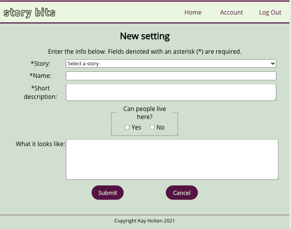

# Story Bits

Story Bits is a story- and world-building tool meant to help writers of all shapes and scopes flesh out and keep track of characters and settings.

Check out the [live site](https://story-bits-app.vercel.app/).

## API documentation

The [API documentation](https://github.com/kayleidoscope/story-bits-api/blob/main/README.md) is available on the story-bits-api repository's README.md.

## Features

### Organize

View stories, characters, and settings in an organized manner, giving you a place to store all of those details!

### Create

Add new stories, characters, and settings. Fill in the required fields, and as much or as little else as you want to.

### Edit

Change your mind? Edit details anytime!

## Tech stack

* Javascript
* React
* Node.js
* Postgres
* HTML
* CSS